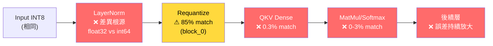

# TVM vs PyTorch 精度比較分析報告

> **日期**: 2026-03-03  
> **結論**: ✅ **精度問題根因確認** — C-model 應使用 TVM 抽取的 golden patterns

---

## 比較結果摘要

| 指標 | 結果 |
|------|------|
| 比較層數 | 122 |
| ✅ 完全一致 | **0** |
| ⚠ 接近 (≥95%) | **0** |
| ❌ 不同 (<95%) | **122** |
| Shape 不匹配 | 12 (`attn_matmul2` 維度排列不同) |
| TVM 獨有的層 | 38 (`add1/add2`, `req_qkv_to_matmul1` 等) |

> [!CAUTION]
> **所有 122 個可比較的層，TVM 和 PyTorch 的整數值完全不同。** 這不是微小的精度差異，而是根本性的差異。

---

## 差異來源分析

### 1. LayerNorm — 差異最大（億級）

| 層 | MaxDiff | 匹配率 |
|----|---------|-------|
| `block_0_norm1` | 1,654,949,112 | 0.0% |
| `block_0_norm2` | 4,294,320,156 | 0.0% |
| `block_11_norm1` | 736,644,361 | 0.0% |

**根本原因**: PyTorch `IntLayerNorm` 內部使用 **float32** 計算 mean/variance 後取整；TVM 使用純 **int64 整數除法和右移**。這兩種方式在每個元素上都會產生不同結果。

### 2. Dense 層（QKV, Proj, FC1, FC2）— 千到萬級

差異來自：
- **輸入不同**: LayerNorm 後的 requantize 結果不同，Dense 層收到的 INT8 輸入就不一樣
- **累積效應**: 矩陣乘法 `Σ(aᵢ × wᵢ)` 會放大輸入差異

### 3. 唯一接近的層 — `block_0_req_norm1_to_qkv`

| 層 | 精確匹配 | ±1 容忍 |
|----|---------|---------|
| `block_0_req_norm1_to_qkv` | 85.3% | 98.0% |
| `block_1_req_norm1_to_qkv` | 5.5% | 15.3% |
| `block_5_req_norm1_to_qkv` | 1.7% | 5.1% |

第一個 requantize 尚未累積太多誤差。但隨著層數增加，匹配率急遽下降。

### 4. TVM 獨有的層（38 個）

```
block_X_add1             (int16) — 殘差連接輸出
block_X_add2             (int16) — 殘差連接輸出
block_X_req_qkv_to_matmul1  (int8)  — QKV→MatMul requantize
embed_conv, embed_add_pos         — 嵌入層輸出
```

這些層在 PyTorch 端沒有對應的獨立輸出，但 C-model 中需要用到。

---

## 差異傳播示意



---

## 建議

1. **C-model 應改用 `patterns_tvm/golden/` 作為 golden reference**
2. **逐層驗證策略**: 從 `block_0` 開始，先驗證 `norm1` → `req_norm1_to_qkv` → `qkv` 路徑
3. **確認 C-model LayerNorm**: 是否使用整數除法（與 TVM 一致）
4. **完整比較結果**: `patterns_tvm/comparison_results.json`
