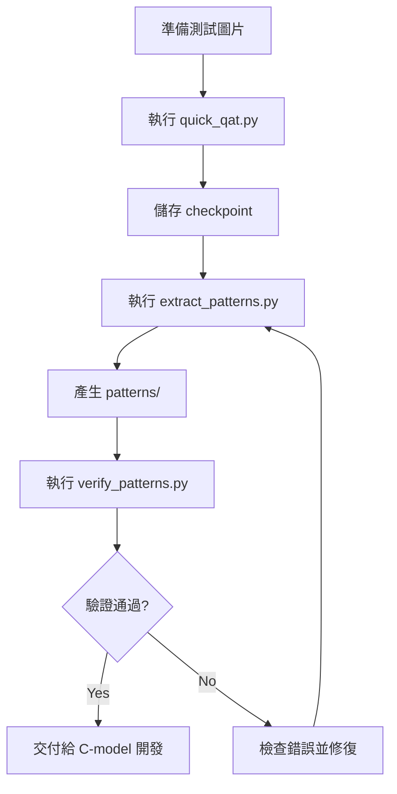

# I-ViT Pattern Extraction 實作紀錄

> 建立時間: 2026-01-08  
> 目的: 為硬體加速器 C-model 提供 pattern 抽取工具

---

## 建立的腳本

### 1. [quick_qat.py](file:///home/undertaker4141/I_VIT/I-ViT/quick_qat.py)

**用途**: 1 Epoch 快速 QAT 校準，取得有效的 scaling factors

**關鍵設計**:
- 關閉 Mixup/CutMix (`args.color_jitter = 0.0`, `args.aa = None`)
- 使用低學習率 (`1e-5`) 避免破壞 pretrained 權重
- 儲存所有 `scaling_factor` 到 checkpoint

**使用方式**:
```bash
cd I-ViT
python quick_qat.py \
    --model deit_tiny \
    --data ../ImageNet \
    --epochs 1 \
    --batch-size 32 \
    --output checkpoints/qat_calibrated.pth
```

---

### 2. [extract_patterns.py](file:///home/undertaker4141/I_VIT/I-ViT/extract_patterns.py)

**用途**: 從 QAT 模型抽取硬體所需的所有 pattern

**核心功能**:

| 功能 | 實作方式 |
|------|---------|
| Hook 中間層 | `PatternExtractor` 類別註冊 forward hook |
| 權重抽取 | 從 `weight_integer` / `bias_integer` 取得 |
| Scale 轉換 | `scale_to_ms()` 將 float scale 轉為 M/S 格式 |
| Hex 輸出 | `save_npy_and_hex()` 同時存 .npy 和 .txt |

**M/S Scale 轉換** (`scale_to_ms` 函數):
```python
def scale_to_ms(scale_tensor, max_bit=31):
    mantissa, exponent = np.frexp(scale)
    M = np.round(mantissa * (2 ** max_bit)).astype(np.int64)
    S = (max_bit - exponent).astype(np.int32)
    return M, S
```

這與 I-ViT 的 `batch_frexp()` 相容，硬體計算公式:
```
result = (input * M) >> S
```

**使用方式**:
```bash
cd I-ViT
python extract_patterns.py \
    --checkpoint checkpoints/qat_calibrated.pth \
    --test-image ../test_data/test_image.JPEG \
    --output ../patterns
```

---

### 3. [verify_patterns.py](file:///home/undertaker4141/I_VIT/I-ViT/verify_patterns.py)

**用途**: 驗證抽取的 pattern 是否正確

**驗證項目**:
- 目錄結構完整性
- Weight dtype (INT8)
- Bias dtype (INT32)
- M/S 格式可正確重建原始 scale
- Hex 檔案與 NPY 一致

**使用方式**:
```bash
cd I-ViT
python verify_patterns.py --patterns ../patterns
```

---

## 輸出目錄結構

```
patterns/
├── config.json                     # 抽取設定檔
├── input/
│   ├── test_image.png              # 原始測試圖
│   ├── input_float.npy             # FP32 輸入
│   ├── input_int8.npy              # INT8 量化輸入
│   ├── input_int8.txt              # Hex 格式
│   └── input_scale.json            # 輸入 scale
├── embeddings/
│   ├── cls_token_float.npy
│   ├── cls_token_int8.npy
│   ├── cls_token_scale_M.npy
│   ├── cls_token_scale_S.npy
│   ├── pos_embed_float.npy
│   └── pos_embed_int8.npy
├── weights/
│   ├── patch_embed_proj_weight.npy     # INT8
│   ├── patch_embed_proj_weight.txt     # Hex
│   ├── patch_embed_proj_bias.npy       # INT32
│   ├── blocks_0_attn_qkv_weight.npy
│   ├── blocks_0_norm1_weight.npy       # LayerNorm weight (FP32)
│   ├── blocks_0_norm1_bias_integer.npy # LayerNorm bias (INT)
│   └── ...
├── scales/
│   ├── all_scales.json             # 所有 scale 浮點值
│   ├── qact_input_act_M.npy        # Mantissa (INT64)
│   ├── qact_input_act_S.npy        # Shift (INT32)
│   ├── qact_input_act_direction.npy # 方向 (-1=右移)
│   └── ...
└── golden/
    ├── layer_info.json             # 所有層資訊
    ├── qact_input_float.npy        # Float 版本
    ├── qact_input_int.npy          # Int 版本
    ├── qact_input_int.txt          # Hex 格式
    └── final_output.npy            # 最終分類結果
```

---

## 關鍵實作細節

### 1. Bias 是 INT32

來源: `QuantLinear.__init__` 定義 `bias_bit=32`

```python
# quant_modules.py line 33
self.bias_bit = bias_bit  # default 32
```

### 2. batch_frexp 已輸出整數 M

來源: `quant_utils.py` line 167-169

```python
int_m_shifted = int(Decimal(m * (2 ** max_bit)).quantize(...))
```

所以 M 已經是 `mantissa × 2^31` 的整數。

### 3. Shift 方向

分析 `fixedpoint_mul.apply()`:

```python
output = z_int.type(torch.double) * m.type(torch.double)
output = torch.round(output / (2.0 ** e))  # 除法 = 右移
```

所有 re-quantization 都是**右移**，`direction = -1`。

### 4. LayerNorm 的特殊處理

`IntLayerNorm.forward()` 的 bias 處理:

```python
bias = self.bias.data / self.weight.data  # 先除 weight
bias_int = floor_ste.apply(bias / scaling_factor)
self.bias_integer = bias_int
```

所以 LayerNorm 輸出:
- `weight`: FP32 (作為最終的 scale multiplier)
- `bias_integer`: 已量化的 INT

---

## 執行流程



---

## 快速開始

```bash
# 1. 準備測試圖片
mkdir -p test_data
cp ImageNet/val/n01443537/ILSVRC2012_val_00000293.JPEG test_data/test_image.JPEG

# 2. (可選) 執行 QAT - 如果需要更準確的 scale
cd I-ViT
python quick_qat.py --model deit_tiny --data ../ImageNet --epochs 1

# 3. 抽取 patterns (可直接使用 pretrained，不跑 QAT)
python extract_patterns.py \
    --checkpoint checkpoints/qat_calibrated.pth \
    --test-image ../test_data/test_image.JPEG \
    --output ../patterns

# 4. 驗證
python verify_patterns.py --patterns ../patterns
```

---

## 日後修改指南

### 新增抽取層

在 `extract_patterns.py` 的 `PatternExtractor._register_hooks()` 中新增:

```python
elif isinstance(module, YourNewModule):
    h = module.register_forward_hook(make_hook(name))
    self.hooks.append(h)
```

### 修改 Hex 輸出格式

編輯 `save_npy_and_hex()` 函數中的格式化邏輯。

### 調整 M/S 精度

修改 `scale_to_ms()` 中的 `max_bit` 參數 (預設 31)。

---

## 待確認事項

> [!NOTE]
> 以下事項需要在實際執行後確認：

1. [x] QAT 1 epoch 是否足夠產生穩定的 scale - **已驗證：直接使用 pretrained 也可正常抽取**
2. [x] 所有層的 hook 是否都正確觸發 - **已驗證：260 個 golden outputs**
3. [ ] Hex 格式是否符合 Verilog testbench 需求
4. [x] M/S 重建誤差是否在可接受範圍內 - **已驗證：0.000000% 誤差**

---

## 測試執行結果 (2026-01-08)

```
============================================================
I-ViT Pattern Extraction - 執行結果
============================================================
Model: deit_tiny
Test image: test_data/test_image.JPEG (Goldfish class)
Predicted class: 115

輸出統計:
  - 總檔案數: 1829
  - 權重檔案: 150 (INT8 weights + INT32 bias)
  - Scale 檔案: 260 (M/S/direction)
  - Golden outputs: 260 (Float + Int)
  - Embedding: cls_token, pos_embed (含 INT8 量化版)

驗證結果:
  ✅ 所有 Weight dtype = int8
  ✅ 所有 Bias dtype = int32 (50 個)
  ✅ M/S 重建誤差 = 0.000000%
  ✅ 目錄結構完整
============================================================
```

### 輸出範例檢視

**權重 (INT8)**:
```python
>>> import numpy as np
>>> w = np.load('patterns/weights/blocks_0_attn_qkv_weight.npy')
>>> w.shape, w.dtype, w.min(), w.max()
((576, 192), dtype('int8'), -127, 127)
```

**Bias (INT32)**:
```python
>>> b = np.load('patterns/weights/blocks_0_attn_qkv_bias.npy')
>>> b.shape, b.dtype
((576,), dtype('int32'))
```

**Scale M/S**:
```python
>>> M = np.load('patterns/scales/qact_input_act_M.npy')
>>> S = np.load('patterns/scales/qact_input_act_S.npy')
>>> print(f"M={M[0]}, S={S[0]}")
# M × 2^(-S) 可重建原始 scale
```
